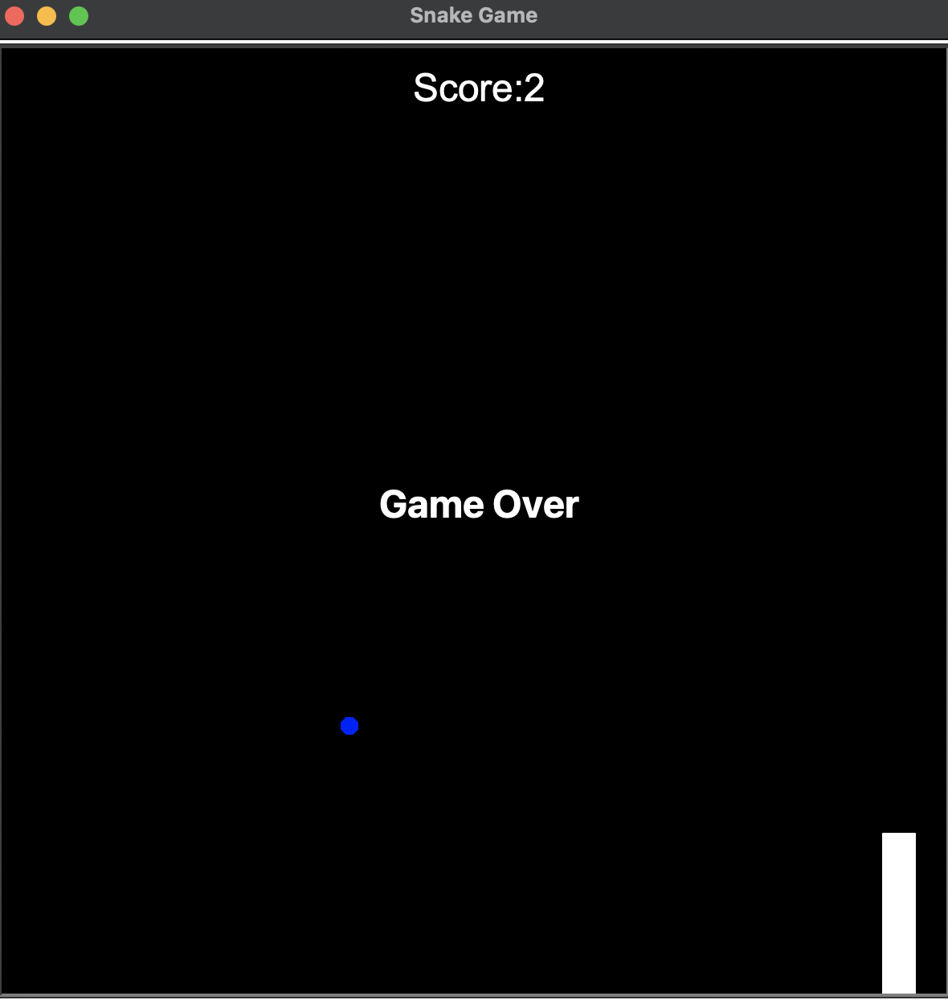

# Snake Game

A classic Snake Game implemented in Python using the Turtle graphics library. Control the snake, eat food to grow longer, and avoid hitting the walls and your own tail!

## Features

- Smooth snake movement with keyboard controls
- Food spawns at random locations
- Score tracking
- Game over detection:
  - Wall collision
  - Self-collision (tail)
- Score display and game over messaging

## How to Play

1. Run the game: `python main.py`
2. Use the arrow keys to control the snake's direction:
   - Up Arrow: Move up
   - Down Arrow: Move down
   - Left Arrow: Move left
   - Right Arrow: Move right
3. Eat the blue food dots to grow the snake and increase your score
4. Avoid hitting the walls and your own tail

## Project Structure

- `main.py`: The main game loop and control flow
- `snake_class.py`: Contains the Snake class that handles movement and growth
- `food.py`: Manages the food object and its random positioning
- `scoreboard.py`: Handles score tracking and display

## Technologies Used

- Python 3
- Turtle graphics library

## Installation

1. Clone this repository:
